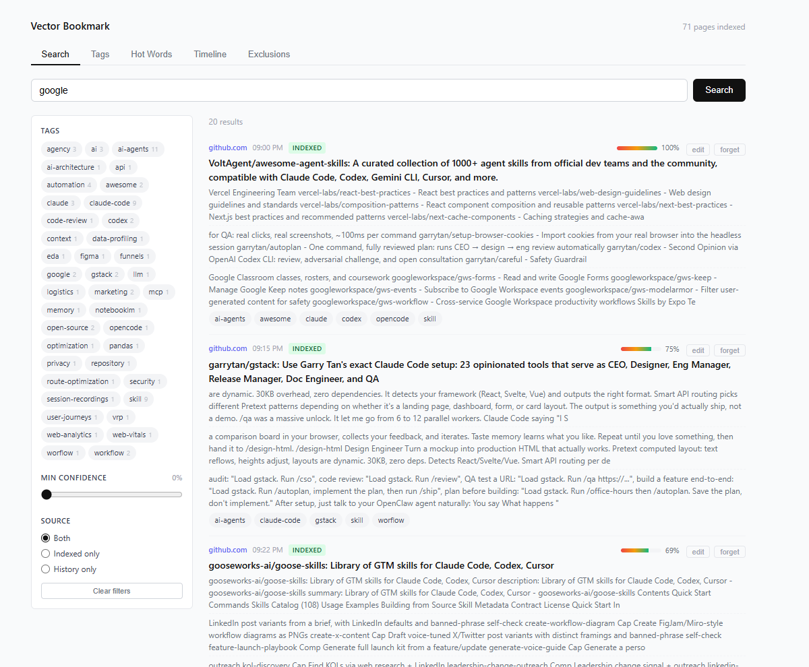
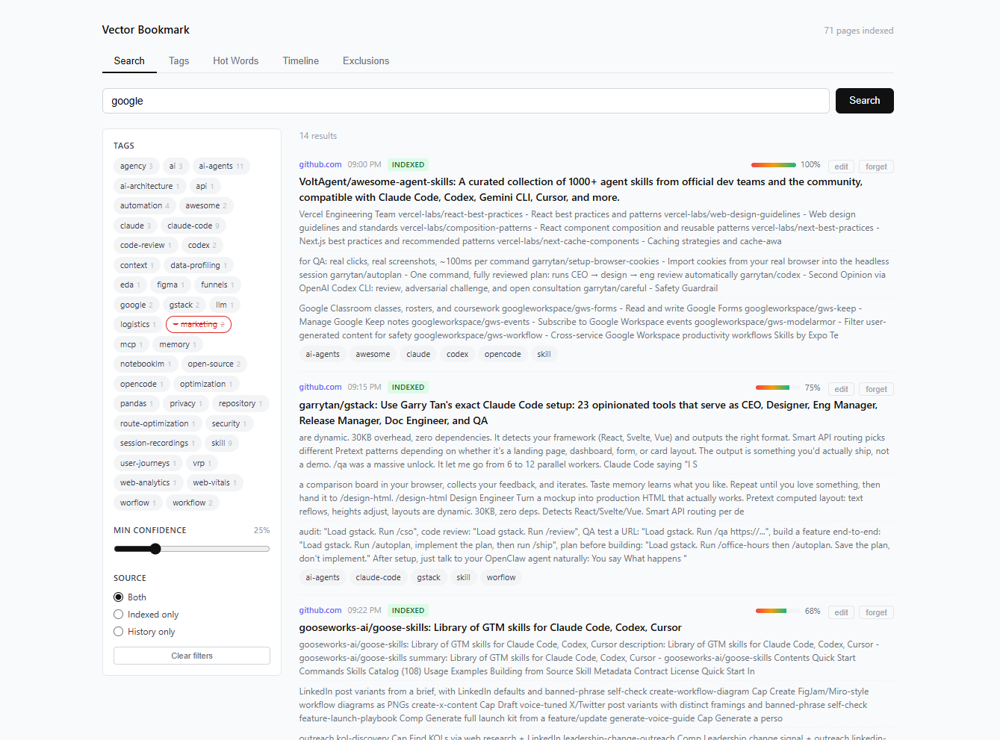
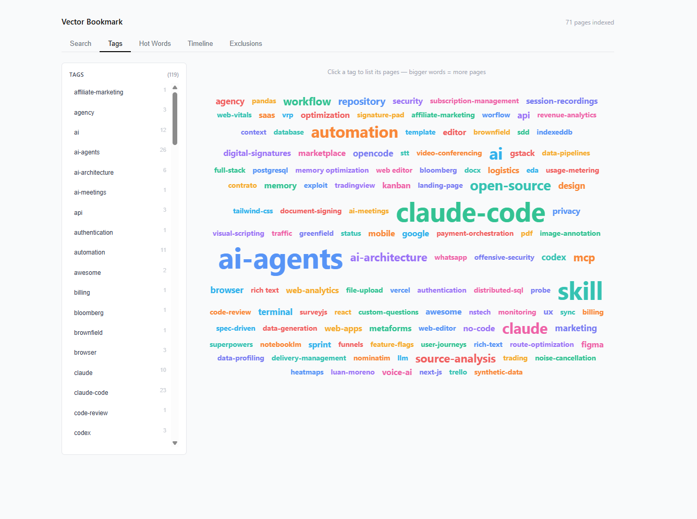
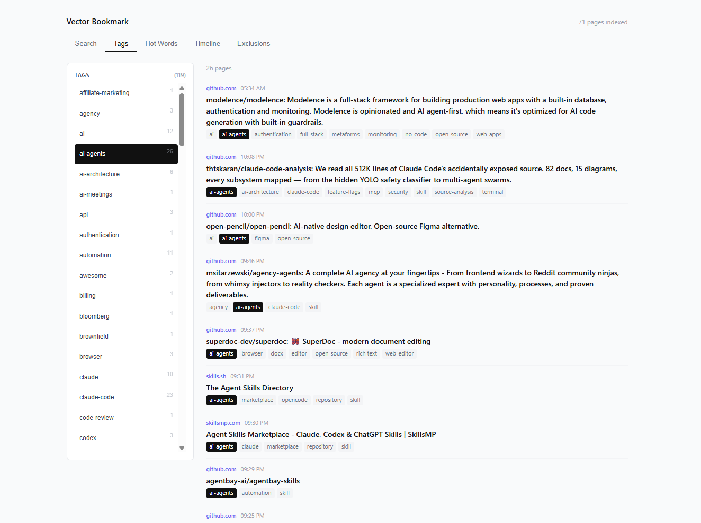
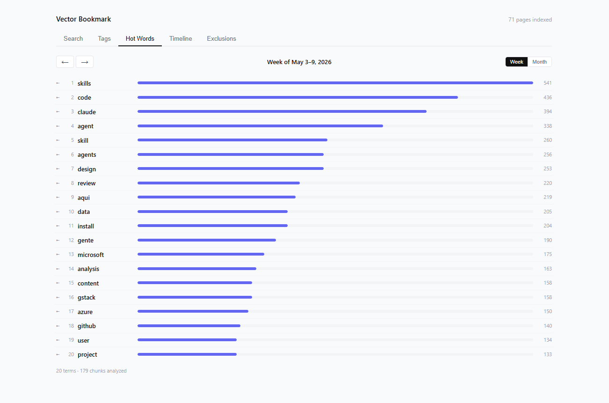
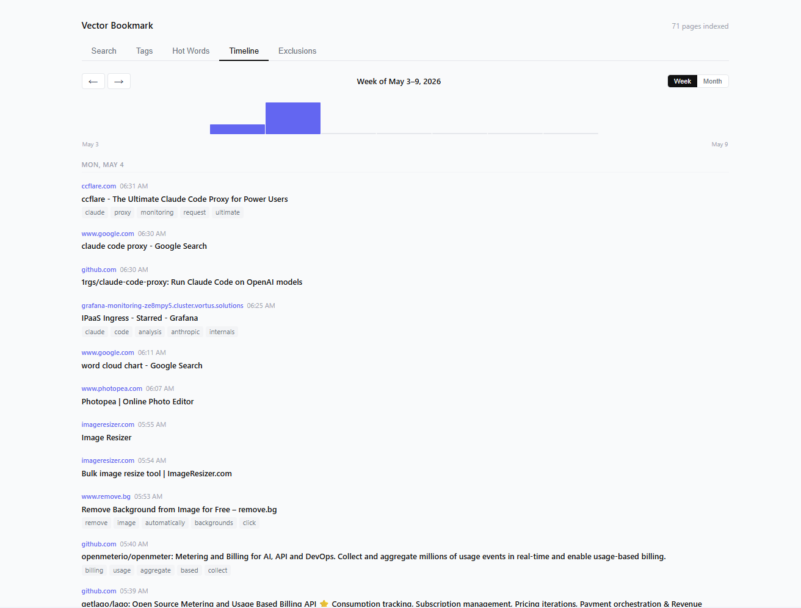
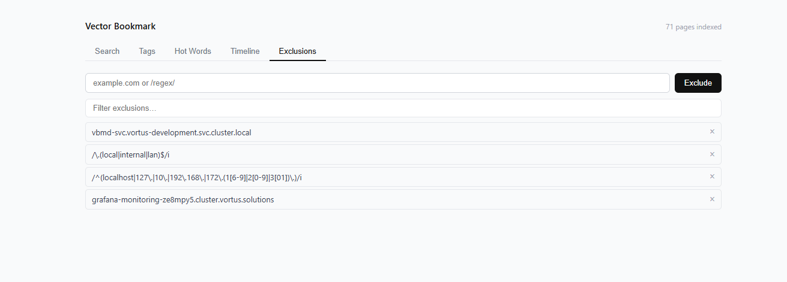

# Vector Bookmark

**Your browser already forgot what you read yesterday. This fixes it.**

Native bookmarks are a dead end: a manually-curated tree that nobody maintains. Browser history is worse — a flat, expiring list with no tags, no semantic search, no segmented timeline of what you actually learned over time. And neither one is private: they sync to a vendor cloud you don't control.

Vector Bookmark replaces both with a local-first semantic memory of everything you've read:

- **Passive capture** — pages you actually dwell on (≥10s) get indexed automatically. No manual filing.
- **Semantic search** — BM25 + embeddings + RRF. Find a page by what it was *about*, not the words you remember from the title.
- **Auto-tagging** — LLM suggests tags from the page; you can curate. Everything is queryable by tag, by week, by source.
- **Evolution timeline** — segmented by week/month, see what you were learning *back then*, not a flat infinite scroll that rolls off.
- **100% local** — Chrome extension + a Go daemon on `127.0.0.1`. SQLite on disk. No telemetry, no cloud, no account. Your reading is yours.

```
Extension ──HTTP──▶ vbmd (127.0.0.1:7532) ──▶ SQLite (BM25 + embeddings)
```

## Screenshots

### Semantic search across everything you've read
Hybrid BM25 + vector recall, with confidence scores, tag faceting, and source filtering (indexed pages vs. raw history).



Tighten the recall with a confidence slider, exclude tags, restrict the source — the same query, narrowed to what you want.



### Tag cloud — your personal knowledge map
Bigger words = more pages. The shape of what you've been reading, at a glance. Click any tag to drill in.





### Hot Words — what dominated your week
Top terms across everything you read this week (or month). The vocabulary of your current obsessions, ranked.



### Timeline — segmented evolution, not a flat history
Week-by-week, day-by-day. Browser history dies after 90 days and gives you no segmentation. This doesn't.



### Exclusions — you decide what is never captured
Block by domain or regex. Internal services, banking, auth pages — they never touch the index.



## Quick start

### Linux

```bash
./build-linux.sh   # build daemon + extension
./dev.sh           # build + start daemon (prints extension load path)
```

### Windows

```bash
# From WSL — cross-compile the exe:
./build-windows.sh
```

```powershell
# From PowerShell — start daemon and get load path:
.\dev.ps1
```

Load the extension: `chrome://extensions/` → **Load unpacked** → `extension/dist/`

---

## Config

Edit `~/.config/vbm/env` (Linux) or `%APPDATA%\vbm\env` (Windows). Loaded at startup.

```ini
VBM_PORT=7532              # default — change if port is taken
VBM_EMBED_URL=http://127.0.0.1:11434/api/embeddings  # Ollama for real semantic search
VBM_TTL_DAYS=90            # auto-delete pages older than N days
VBM_LOG_LEVEL=info         # debug / info / warn / error
```

If you change `VBM_PORT`, update it in the extension popup (Daemon section).

## Install as service (Linux)

```bash
cd daemon && make install   # installs binary + systemd user unit
```

## Uninstall

```bash
cd daemon && make uninstall
rm -rf ~/.local/share/vbm/  # optional — deletes all indexed data
```

## Dev commands

```bash
cd daemon && make run        # run tests then build + start daemon
cd extension && npm run dev  # watch mode for extension
cd extension && npm test     # run extension unit tests
cd daemon && go test ./...   # run daemon unit tests
curl http://127.0.0.1:7532/healthz
curl http://127.0.0.1:7532/metrics
```

---

## Docker

The daemon ships as a single Alpine-based image (~19 MB). Unit tests run
inside the build stage, so a failing test prevents a broken image from being
published.

### Docker Compose (recommended for local use)

```bash
docker compose up -d          # build image + start daemon
docker compose logs -f vbmd   # follow logs
docker compose down           # stop
```

Data is persisted to `~/.local/share/vbm/` on the host (same path as the
native install, so switching between modes keeps your history).

To enable semantic search / LLM features, set the relevant env vars before
starting:

```bash
VBM_EMBED_API_KEY=sk-... \
VBM_EMBED_URL=https://api.openai.com/v1/embeddings \
docker compose up -d
```

Or uncomment the matching lines in `docker-compose.yml`.

### Build and publish to Docker Hub

```bash
DOCKERHUB_USER=<your-user> ./publish-docker.sh [tag]

# Non-interactive (CI):
DOCKERHUB_USER=alice DOCKERHUB_TOKEN=dckr_pat_xxx ./publish-docker.sh v0.1.0
```

The script refuses to publish from a dirty working tree. Override with
`ALLOW_DIRTY=1`. Both `:<tag>` and `:latest` are pushed unless `SKIP_LATEST=1`.

### Run a pre-built image manually

```bash
docker run --rm -p 127.0.0.1:7532:7532 \
  -v ~/.local/share/vbm:/data \
  -e VBM_EMBED_URL=http://host-gateway:11434/api/embeddings \
  <your-user>/vbmd:latest
```

---

## Kubernetes

Manifests live in `k8s/`. They create a dedicated `vbm` namespace, a 1 Gi
PersistentVolume (hostPath — swap for a cloud storage class in production), and
a ClusterIP Service on port 7532.

### Deploy

1. **Replace the image placeholder** in `k8s/deployment.yaml`:

   ```bash
   sed -i 's/<DOCKERHUB_USER>/alice/' k8s/deployment.yaml
   ```

2. **(Optional) Create the LLM secret** if you want semantic search:

   ```bash
   kubectl create secret generic vbm-llm-secret \
     --namespace vbm \
     --from-literal=VBM_EMBED_API_KEY=sk-...
   ```

   Then uncomment the `VBM_EMBED_URL` and `VBM_EMBED_API_KEY` env blocks in
   `k8s/deployment.yaml`.

3. **Apply all manifests**:

   ```bash
   kubectl apply -f k8s/
   ```

4. **Check health**:

   ```bash
   kubectl -n vbm get pods
   kubectl -n vbm port-forward svc/vbmd 7532:7532
   curl http://127.0.0.1:7532/healthz
   ```

### Tear down

```bash
kubectl delete -f k8s/
# PV uses reclaimPolicy: Retain — delete manually if you want to wipe data:
kubectl delete pv vbm-data-pv
```

---

## Privacy

- All data stays on your machine (`~/.local/share/vbm/vbm.db`)
- Incognito windows: never captured
- Sensitive domains (banks, `.gov`, auth pages): blocked by default
- `DELETE /forget` removes any page or domain permanently
